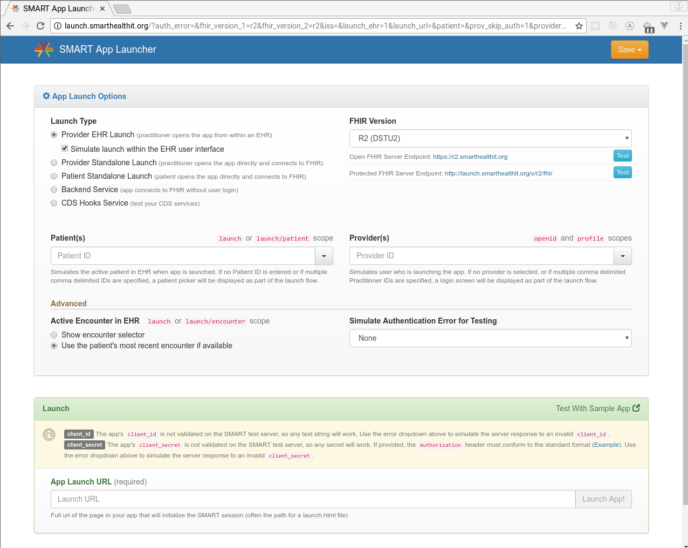

# bb-clear-smart-fhir
SMART on FHIR implementation of the clear blue button health record reference

[](https://travis-ci.org/stfnh/bb-clear-smart-fhir) [](https://github.com/facebook/jest)

A sample [SMART on FHIR](http://docs.smarthealthit.org/) app, implementing the [Blue Button Health Record Format](https://github.com/blue-button/bbClear). Work in progress.

Built with [Vue.js](https://vuejs.org/), continous integration with [Travis](https://travis-ci.org/stfnh/bb-clear-smart-fhir), automated unit tests by [Jest](https://jestjs.io/). Hosted on GitHub Pages (needs to be launched from a SMART on FHIR sandbox, see below).

# Getting started

## Run the app using SMART App Launcher

1. Go to http://launch.smarthealthit.org/
2. Leave all settings as they are (FHIR Version R2/DSTU2).
3. At the bottom of the page, set the App Launch Url to: `https://stfnh.github.io/bb-clear-smart-fhir/launch.html`
4. Click `Launch App`
5. Login as practitioner
6. Select a patient
7. You will see the SMART on FHIR app populated with data from the Sandbox / Electronic Health Record system!



## Local setup for development and testing

- Prerequisites: Install current versions of [Node](https://nodejs.org/en) and [Yarn](https://yarnpkg.com/lang/en/) (alternatively npm).

Get a local copy / clone repository:

```
$ git clone git@github.com:stfnh/bb-clear-smart-fhir.git
```

Install the dependencies:

```
$ cd bb-clear-smart-fhir
$ yarn
```

Serve on localhost:

```
$ yarn serve
```

This will use an open access FHIR server for testing, no OAuth2 necessary. For details see the [smartClient implementation](./src/smartClient.js).

Create a production build and [serve](https://github.com/zeit/serve#readme):

```
$ yarn build
$ serve -s dist/
```

You can now test the app using the [SMART App Launcher](http://launch.smarthealthit.org/). Use the URL to launch.html as the APP Launch URL (normally http://localhost:5000/launch.html). This app was also tested with [Cerner's Code Console](https://code.cerner.com/developer/smart-on-fhir/apps).
